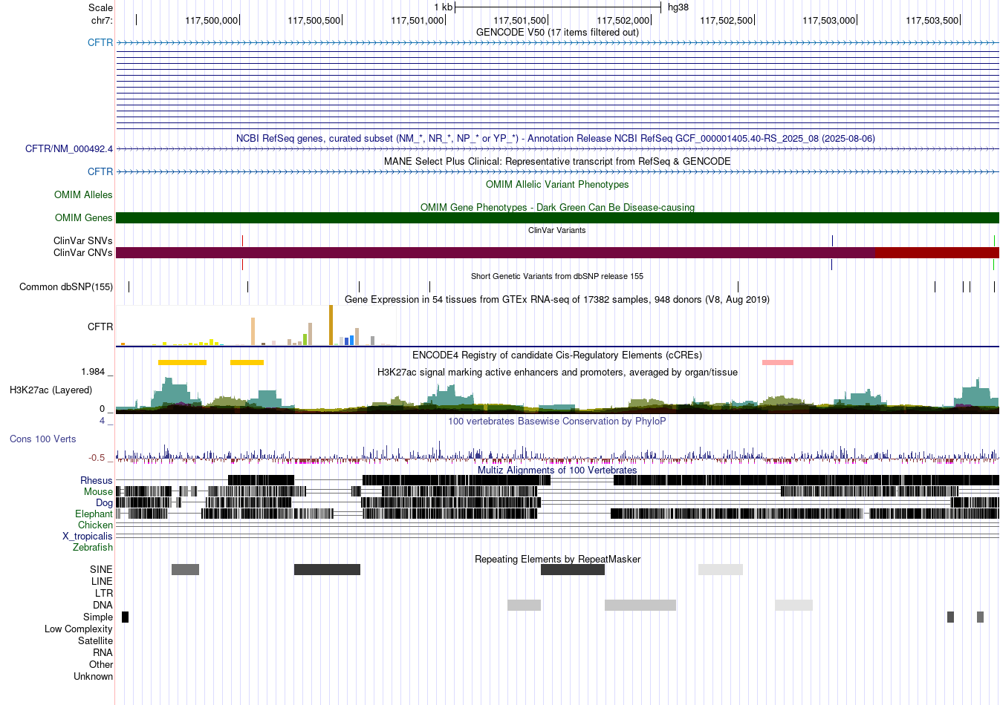
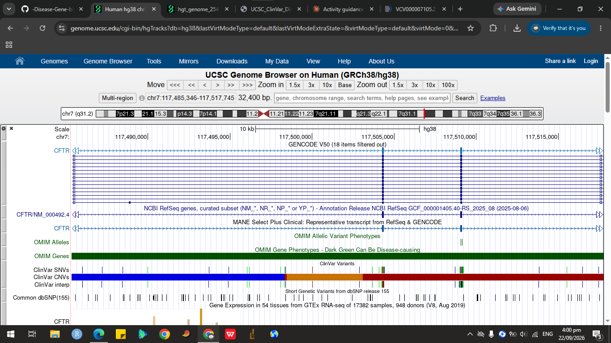
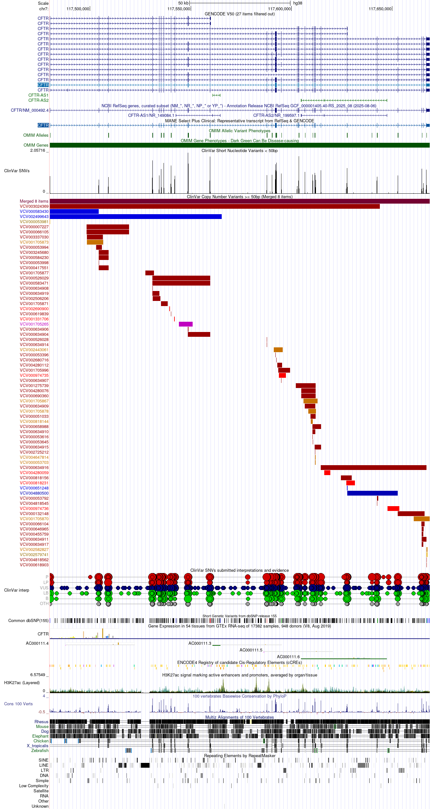
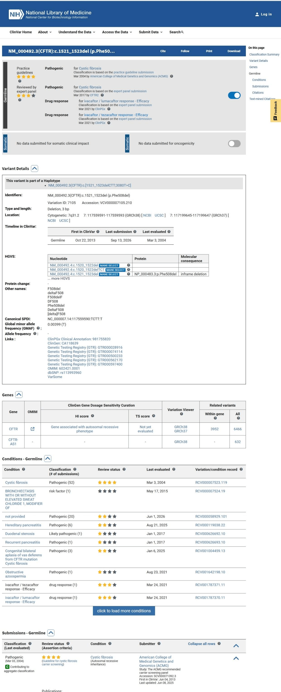
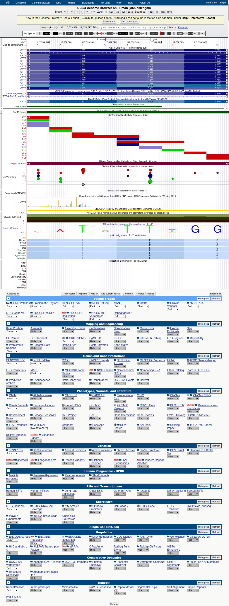

# Exploring a Human Disease Gene Using UCSC Genome Browser and NCBI ClinVar

**Name:** Isabella Tuble

**Date:** September 22, 2026

**Assigned Gene:** CFTR (Cystic Fibrosis Transmembrane Conductance Regulator)

**Associated Disease:** Cystic Fibrosis

## Assigned Gene and Disease

CFTR encodes a chloride ion channel found in epithelial cells. Mutations that disrupt its function cause cystic fibrosis, an autosomal recessive disease affecting the lungs, pancreas, and other organs.

## UCSC Gene Location

**Official gene symbol:** CFTR

**Full gene name:** CF transmembrane conductance regulator

**Chromosome:** chr7 (7q31.2)

**Genome assembly used:** GRCh38/hg38

**Genomic coordinates shown in UCSC:** chr7:117559592-117559594

**DNA strand:** – (minus)

**Approximate gene size:** 100 kb

**Screenshot 1 — Gene location:**
`images/01_gene_location.png`

## Exons, Introns, and Transcripts

**Transcript selected:** NM_000492.3

**Number of exons identified:** 27

**Multiple transcripts/isoforms visible?** Yes — both RefSeq and GENCODE tracks show several isoforms, each with slightly different exon usage.

**Exon vs. intron** 

Exons are the coding segments of a gene that remain in the mature mRNA after splicing. They contain instructions for building the protein. Introns are the non‑coding sequences between exons; they are transcribed into RNA but removed during splicing, so they do not appear in the final mRNA.

**Intron vs. exon length:**

The exons appear as short blue rectangular boxes with arrows in the CFTR gene track. The introns are the long connecting lines between those boxes. In CFTR, the introns are much longer than the exons. The gene spans ~189 kb across chromosome 7, but the mature mRNA is only ~4.4 kb. This means the majority of the gene’s sequence is intronic, while the exons are relatively short coding blocks.

**Screenshot 2 — Gene structure:**
`Images/02_gene_structure.png`

##  UCSC Annotation Tracks

**Gene annotation track used:** NCBI RefSeq and GENCODE V50

**ClinVar-related variant marks visible?** Yes — multiple marks are visible in the ClinVar SNVs/CNVs/interp tracks. They appear as red and blue bars scattered across the CFTR gene region, showing a high density of reported variants.

**Conservation — were some regions more conserved than others?** Yes — certain regions show stronger conservation signals than others. Coding exons tend to be more conserved, while intronic regions show weaker conservation overall.

**Did conserved regions correspond mainly to exons, introns, both, or another region?** The strongest conservation corresponds mainly to exons, though some non-coding regulatory regions also show conservation.

**Why can strong conservation suggest biological importance? (2–3 sentences)**

Strong conservation across species suggests that a sequence is functionally important. Regions critical to protein structure or gene regulation are preserved by natural selection because mutations in these areas are often harmful. Therefore, conserved exons or regulatory elements are likely essential for proper CFTR function and stability.

**Screenshot 3 — Additional track(s):**
`Images/03_tracks.png`

## Selected ClinVar Variant

**Gene:** CFTR

**Variant name / HGVS description:** NM_000492.4(CFTR):c.1521_1523delCTT (p.Phe508del) 

**rsID:** rs113993960

**ClinVar Variation ID / VCV accession:** VCV000007105 (Variation ID: 7105)

**Chromosome and genomic position (GRCh38):** chr7:117,559,591–117,559,593

**Chromosome and genomic position (GRCh37), for reference:** chr7:117,199,645–117,199,647

**Associated condition/disease:** Cystic fibrosis

**Clinical significance (exactly as reported):** Pathogenic

**Review status:** Reviewed by expert panel; practice guideline (4‑star rating)

**ClinVar record URL:** [https://www.ncbi.nlm.nih.gov/clinvar/variation/7105/](https://www.ncbi.nlm.nih.gov/clinvar/variation/7105/)

**Screenshot 4 — ClinVar variant record:**
`Images/04_clinvar_variant.png`

## Locating the Variant in UCSC

**UCSC coordinate used to navigate:** chr7:117559592-117559594 (GRCh38/hg38)

**Where is the variant located relative to the gene?** Within the CFTR gene body, specifically inside exon 11.

**Exon, intron, UTR, splice region, or other?** Exon (coding region).

**Coding or non-coding?** Coding region — the deleted codon corresponds to phenylalanine at position 508 of the CFTR protein.

**How might this variant affect the gene or gene product? (brief explanation)**

F508del is an in‑frame 3‑bp deletion that removes the codon for phenylalanine at position 508. Because the reading frame is preserved, the protein is still produced but misfolds. Misfolded CFTR is degraded before reaching the cell membrane, drastically reducing chloride channel activity and leading to the cystic fibrosis phenotype.

**What additional evidence would be needed before concluding the variant causes disease?**

Functional studies of CFTR folding and chloride transport, segregation analysis in affected families, population frequency data, and multiple independent clinical case reports. These provide experimental and clinical validation beyond just the genomic location.

**Screenshot 5 — Variant located in UCSC:**
`Images/05_variant_in_ucsc.png`

## Interpretation

From the UCSC Genome Browser analysis of CFTR, I observed that the gene spans ~189 kb but contains only 27 exons, meaning most of its sequence is intronic. The introns are visibly much longer than the exons, which are compact coding segments. Multiple transcript isoforms are present, but the canonical transcript NM_000492.4 is most often referenced.

ClinVar tracks show a high density of reported variants across CFTR, with many classified as pathogenic. The strongest conservation signals correspond mainly to exons, highlighting their functional importance. The F508del variant, located in exon 11, is a well‑studied pathogenic deletion that removes a single amino acid. Although it does not cause a frameshift, the protein misfolds and is degraded, leading to loss of chloride channel activity.

This analysis demonstrates how combining gene structure, conservation, and clinical variant data provides a comprehensive view of CFTR’s biological and medical significance.

## Reflection

Through the UCSC Genome Browser, I discovered aspects of CFTR that were not obvious from simply reading about its function. The visualization made clear how the gene spans a very large genomic region with long introns and relatively short exons, and how multiple transcript isoforms exist beyond the canonical one. Knowing the exact genomic location of a disease‑associated variant, such as F508del, is useful because it allows precise mapping relative to exons, comparison across databases, and consistent identification regardless of naming conventions. However, one limitation of predicting a variant’s effect only from its genomic location is that location alone does not confirm functional impact, experimental studies and clinical evidence are still needed to validate pathogenicity. The most interesting feature I observed about CFTR was the density of ClinVar variants across its exons, especially the well‑studied F508del in exon 11, which highlights how a single amino acid deletion can have profound consequences for protein folding and human health

## References and Links

UCSC Genome Browser: [https://genome.ucsc.edu/](https://genome.ucsc.edu/)

UCSC Genome Browser 101 Tutorial: [https://genome.ucsc.edu/docs/tutorials/gb101.html](https://genome.ucsc.edu/docs/tutorials/gb101.html)

NCBI ClinVar: [https://www.ncbi.nlm.nih.gov/clinvar/](https://www.ncbi.nlm.nih.gov/clinvar/)

NCBI ClinVar Search Help: [https://www.ncbi.nlm.nih.gov/clinvar/docs/help/](https://www.ncbi.nlm.nih.gov/clinvar/docs/help/)

Selected ClinVar record: [https://www.ncbi.nlm.nih.gov/clinvar/variation/7105/](https://www.ncbi.nlm.nih.gov/clinvar/variation/7105/)

